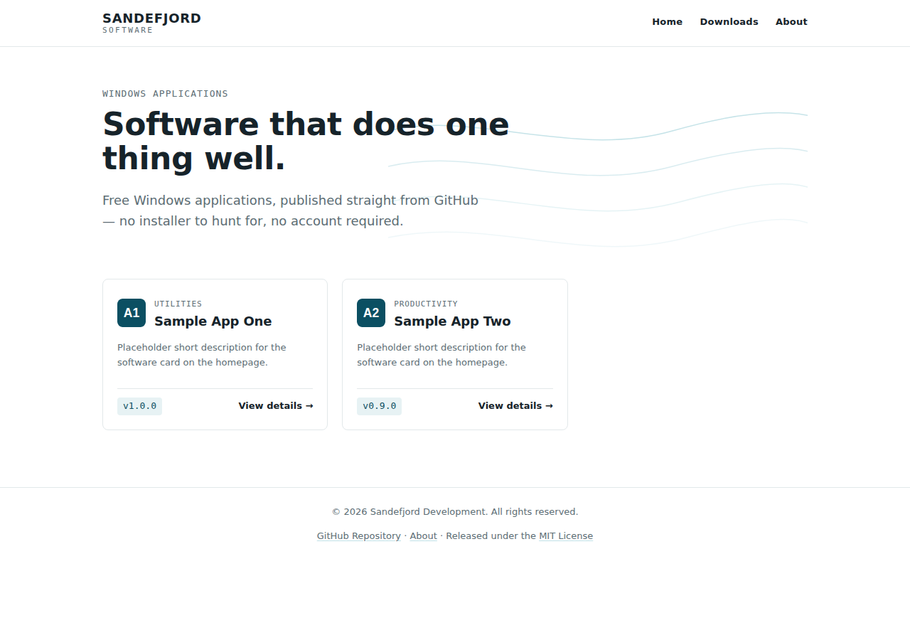

# Sandefjord Software — Website

Static showcase website for Windows applications published by Sandefjord Software.

Live site: https://patrickjaillet.github.io/sandefjord-software/



## Project structure

```
src/            Source files (HTML, CSS, JS)
src/partials/   Shared header/footer, injected at build time
docs/           Build output served by GitHub Pages
assets/         Icons and screenshots
data/           Generated software catalog (software.json)
scripts/        Build, GitHub release sync, and local static server scripts
tests/e2e/      Playwright functional and accessibility tests
templates/      Workflow template for software repositories (release notification)
```

## Pages

- `index.html` — homepage, software listed as cards
- `software.html?id=<software-id>` — software detail template (description, screenshots, changelog, download)
- `downloads.html` — all software and their current versions
- `about.html` — copyright, creator, contact, official repository
- `404.html` — custom not found page
- `admin.html` — client-side admin panel (not linked publicly, `noindex`), see below

## Stack

Static HTML/CSS/JS, no framework. A Node.js script synchronizes the software
catalog from GitHub Releases (see `scripts/sync-releases.mjs`) and regenerates
`data/software.json`. Running `npm run build` injects the shared header/footer
partials into every page and outputs the final site into `docs/` for GitHub Pages.

`data/site-content.json` holds the editable homepage hero text, fetched at
runtime the same way as the software catalog.

## Automatic sync with GitHub Releases

Any repository owned by `Patrickjaillet` tagged with the GitHub topic
`sandefjord-software` is treated as a product and picked up automatically —
no manual admin step required to add a new app to the site.

- `npm run sync` (`scripts/sync-releases.mjs`) lists matching repositories,
  reads their published releases, and rebuilds `data/software.json`: current
  version, full changelog, and a downloadable version history with release
  assets. Editorial fields (name, description, category, icon, screenshots,
  system requirements) are preserved across runs once set; only
  release-derived fields are refreshed. Repos are matched across renames by
  their stable GitHub repo id, archived repos are skipped, and repos without
  any published release yet are skipped until their first release.
- `.github/workflows/sync.yml` runs this automatically: on a 6-hour cron
  safety net, on `workflow_dispatch`, and on a `repository_dispatch` event
  named `release-published` for instant updates. It syncs, rebuilds `docs/`,
  and commits/pushes both — GitHub Pages redeploys from the updated `docs/`
  on that push.
- `templates/notify-sandefjord-software.yml` is a workflow to copy into each
  software repository so it pings this repo the moment it publishes a
  release, instead of waiting for the cron safety net. It needs a
  `SITE_DISPATCH_TOKEN` secret (PAT with `contents:write` on this repo) set
  on the software repository.

## Comments, likes, and sharing

Each software detail page has a comments section powered by
[giscus](https://giscus.app), backed by GitHub Discussions on this repo —
no separate backend or database. Comments are lazy-loaded: the widget's
script only loads when a visitor clicks "Show comments", so it never
affects the page's initial load performance. Likes reuse the 👍 reaction
on each software's discussion instead of a separate counter.

**Setup status** — done and live: Discussions is enabled on this repo,
`GISCUS_REPO_ID`/`GISCUS_CATEGORY_ID` in `src/js/main.js` hold the real
repo node ID and the built-in "General" category (GitHub's API has no
way to create a custom category, only the web UI does, so "General" is
used instead of a dedicated one), and the
[giscus GitHub App](https://github.com/apps/giscus) is installed on
`Patrickjaillet/sandefjord-software`.

Each software's comments map to its `id` (stable across renames), not its
URL, so a discussion always stays attached to the right software.

**Moderation** happens entirely through GitHub's own Discussions UI —
no separate moderation tool:

- **Hide a comment** — open the discussion (linked from the "Comments"
  section note, or `github.com/Patrickjaillet/sandefjord-software/discussions`),
  click the `···` menu on the comment, choose "Hide comment", and pick a
  reason (spam, off-topic, abuse, etc.).
- **Delete a comment** — same `···` menu, "Delete".
- **Lock a discussion** to stop new comments on a specific software
  (keeping the existing thread visible) from the discussion's `···` menu
  → "Lock conversation".
- Repeated abuse from one account can be blocked from commenting on the
  repo entirely via Settings → Moderation options → Interaction limits,
  or by blocking the user from the organization/account.

**Sharing** — every software has a "Share" row (copy link, native
Web Share API on supported devices, and plain links to X, Reddit,
LinkedIn, and email). No third-party SDK, no tracking script, and no
share-count is shown (the count APIs from those platforms are deprecated
or unreliable) — only the share action itself.

`scripts/sync-engagement.mjs` (`npm run sync-engagement`) fetches each
software's like/comment counts from its Discussion via the GitHub GraphQL
API and stores them in `data/software.json` as `engagement`, the same way
`sync-releases.mjs` refreshes release data. `.github/workflows/sync.yml`
runs it automatically on the existing 6-hour cron — no separate workflow.

## Admin panel

`admin.html` is a client-side CMS: GitHub Pages has no backend, so it
authenticates with a GitHub token (fine-grained, `contents:write` on this
repo, or a classic token with the `repo` scope) pasted in by hand and
encrypted at rest in the browser's `localStorage` with a passphrase
(PBKDF2 + AES-GCM — the token never leaves the browser except to call the
GitHub API directly). Access is hard-restricted to the `Patrickjaillet`
account via `GET /user`.

From the dashboard you can add, edit, hide, reorder, and delete software,
upload icons/screenshots (drag tiles in the edit form to reorder them),
edit the current version's changelog notes, and edit the homepage hero
text. Every save previews the change client-side first, then commits
atomically (via the Git Data API, one commit for every changed file)
straight to `main` — which also appends a line to `CHANGELOG.md` in the
same commit and redeploys the site through GitHub Pages. A "Recent
activity" panel on the dashboard reads the actual Git commit history, and
a "Force sync now" button triggers `sync.yml` on demand (`workflow_dispatch`
via the GitHub API) instead of waiting for the next 6-hour cron — this
needs the "Actions: write" permission on a fine-grained token (classic
`repo`-scoped tokens already include it).

The page is not linked from the public navigation, is marked `noindex`, and
is disallowed in `robots.txt`. It's still a public URL on a public repo:
treat the token passphrase as the only thing standing between the page and
write access to this repo, and revoke the token from GitHub if you ever
suspect it leaked.

## Maintenance

**Adding a new piece of software** — two ways:
1. Tag its GitHub repo (owned by `Patrickjaillet`) with the topic
   `sandefjord-software` and publish a release with installer assets
   (`.exe`/`.msi`/`.zip`). It appears on the site within 6 hours (the sync
   cron), or instantly if you copy `templates/notify-sandefjord-software.yml`
   into that repo. Refine the auto-generated description/category/screenshots
   afterward from the admin panel or by editing `data/software.json` directly
   — those fields are preserved across future syncs.
2. For software without a GitHub repo, use "+ Add software" in the admin
   panel — the sync process ignores entries with no linked repo, so they
   stay exactly as entered.

**How updates propagate automatically** is covered above under "Automatic
sync with GitHub Releases" (new releases) and "Admin panel" (manual edits) —
both end in a commit to `main`, which GitHub Pages redeploys from.

**Content review** — `npm run check-content` (`scripts/check-content.mjs`)
checks every software entry's current download link and latest release
assets for dead links (HTTP HEAD, non-2xx = broken) and flags any linked
repository that's been archived. `.github/workflows/content-check.yml` runs
it weekly and on demand: if it finds problems, it opens (or comments on) a
GitHub issue labeled `content-review` with the details; once a later run
finds nothing, it closes that issue automatically.

## Quality: continuous integration and automated tests

Every Pull Request against `main` runs `.github/workflows/ci.yml`:

- `npm run build` and `npm run check-content` to catch build errors and dead
  links before merge.
- `npm test` (`playwright.config.js` + `tests/e2e/`) — Playwright tests
  covering the homepage (search, category filter, sort, the `/` search
  shortcut), the downloads table, and a software detail page, plus an
  automated accessibility scan (`@axe-core/playwright`) on the homepage,
  downloads, What's New, About, and a software detail page. This replaces
  the one-off manual Lighthouse/axe audits from Phase 5/12 with a check that
  runs on every change.
- A [Lighthouse CI](https://github.com/treosh/lighthouse-ci-action) job
  against the built `docs/` output, asserting on the same categories audited
  in Phase 5 (`.lighthouserc.json`): Accessibility, Best Practices, and SEO
  must stay at 100, Performance must stay at 95+ (a slightly lower floor than
  the 99 observed in Phase 5, to absorb normal CI-runner variance).

Run the same checks locally with `npm run build`, `npm run serve` (a small
static server for `docs/`, `scripts/serve.mjs`), and `npx playwright test`
(requires `npx playwright install` once, to fetch browser binaries).

## Download integrity (SHA-256 checksums)

`scripts/sync-releases.mjs` computes a SHA-256 checksum for each software's
current primary download and stores it as `downloadSha256` in
`data/software.json`. It's shown next to the download button on
`software.html` with a "Copy" button, so a visitor can verify the file they
downloaded wasn't altered or corrupted — the same convention used by sites
like Softpedia or MajorGeeks. Checksums already computed in a previous sync
are reused rather than re-downloading the asset every run.

## What's New feeds

`whats-new.html` is available as both RSS (`docs/rss.xml`) and JSON Feed 1.1
(`docs/feed.json`, generated by `buildJsonFeed()` in `scripts/build.mjs`),
with autodiscovery `<link>` tags on the homepage and the What's New page.

## SEO, security, and everyday polish

- **Structured data** — every product page ships a `SoftwareApplication`
  JSON-LD block (`setStructuredData()` in `main.js`): name, description,
  category, version, operating system, free `Offer`, and — once
  `sync-engagement.mjs` has data — like/comment counts as
  `interactionStatistic` (not a fabricated star rating, to stay within
  Google's structured-data guidelines).
- **Skip link** — the first focusable element on every public page is a
  "Skip to content" link (`.skip-link` in `src/partials/header.html`),
  visible on keyboard focus, jumping to `#main-content`.
- **Content-Security-Policy** — every public page sets a strict CSP via
  `<meta http-equiv>`: `default-src 'self'`, with `https://giscus.app`
  allow-listed for `script-src`/`frame-src`/`connect-src` (the comments
  widget). No `'unsafe-inline'` for scripts: per-page init calls that used
  to be inline `<script>` tags are now dispatched from a `data-page`
  attribute on `<body>` at the end of `main.js`. The admin panel
  (`admin.html`) intentionally has no CSP — it's not a public page and
  needs broader access to call the GitHub API directly.
- **Recently viewed** — the homepage shows up to 4 recently viewed
  software, tracked entirely in the visitor's own `localStorage`
  (`sandefjord_recently_viewed_v1`) — nothing is sent anywhere, and the
  section stays hidden until something's been viewed.
- **Report an issue** — the product page links directly to
  `<software repo>/issues/new`, next to the existing "View on GitHub"
  link (both hidden for manually-added software with no linked repo).
- **GitHub Sponsors** — the About page only shows a "Support this
  project" link if a Sponsors profile actually exists for the account;
  `hasSponsorsProfile()` in `build.mjs` checks this at build time (a
  browser-side check would be blocked by CORS) and stores the result in
  `data/site-content.json`, so a dead link is never shown.

## Design

White theme, one accent color, no decoration beyond what's needed:

- **Color** — background `#FFFFFF`, text `#16232A`, accent (fjord teal) `#0B4F62`
- **Type** — system UI fonts for headings/body; monospace (Cascadia Code / Consolas)
  reserved for factual data: version numbers, dates, requirements
- **Signature** — a quiet fjord contour-line illustration in the homepage hero,
  the only deliberate visual flourish on the site
- No 3D, no animation libraries; transitions respect `prefers-reduced-motion`

Full token list in `src/css/style.css`.

## License

MIT — see [LICENSE](./LICENSE).

## About

**SANDEFJORD SOFTWARE**
Copyright © 2026 SANDEFJORD DEVELOPMENT — All rights reserved
Creator: Patrick JAILLET
Email: sandefjordsoftwaredevelopment@gmail.com
Website: https://github.com/Patrickjaillet
Official Repository: https://github.com/Patrickjaillet/sandefjord-software
